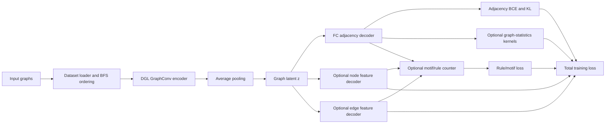

# GraphVAE-REQ

GraphVAE-REQ is a graph-level **GraphVAE** codebase for graph generation with
optional rule- and feature-aware training losses. The current project extends a
GraphVAE-style encoder/decoder pipeline with:

- graph generation from a graph-level latent vector
- optional graph-statistics kernels for GraphVAE-MM style training
- optional node and edge feature decoders
- optional differentiable motif/rule-count losses from FactorBase rules
- reproducibility scripts for statistics-based and GNN-based graph realism
  evaluation

This repository is **not** the VGAE implementation described in the related
paper below. The paper studies Variational Graph Autoencoders (VGAE), while this
repository uses a GraphVAE architecture: a DGL graph-convolution encoder, graph
pooling to a single graph embedding, and an MLP decoder that reconstructs the
whole adjacency matrix.

## Related Paper

The rule-learning motivation is related to:

- [Rule-Enhanced Graph Learning on OpenReview](https://openreview.net/forum?id=m02qzfjlHA)
- [ICML 2024 workshop listing](https://icml.cc/virtual/2024/36995)
- [PDF](https://openreview.net/pdf?id=m02qzfjlHA)

That paper introduces rule moment matching for graph generative models: expected
rule or motif counts produced by a model are encouraged to match observed rule
counts in data. This repository uses that idea as related motivation, but the
implementation here is different: it is built on GraphVAE and integrates
rule/motif losses into this repository's existing graph-level training loop.

## Current Architecture



The main entry point is [`main.py`](main.py).

## What The Code Trains

The model in [`model.py`](model.py) is `kernelGVAE`, a graph-level VAE wrapper
around:

- `AveEncoder`: DGL `GraphConv` layers followed by average pooling and latent
  mean/log-std heads.
- `GraphTransformerDecoder_FC`: an MLP that decodes a graph latent vector into a
  dense adjacency matrix.
- optional `NodeFeatureDecoder` and `EdgeFeatureDecoder` heads from
  [`util.py`](util.py).

Model aliases:

- `GraphVAE` maps to the base graph-level VAE path.
- `GraphVAE-MM` enables graph-statistics kernels such as transition matrices,
  degree distributions, and triangle counts.

The total loss is assembled in [`main.py`](main.py) from:

- adjacency reconstruction and KL terms
- optional graph-statistics kernel terms
- optional node feature reconstruction loss
- optional edge feature reconstruction loss
- optional motif/rule-count loss

The default config currently trains a QM9 GraphVAE baseline with motif loss
disabled and node/edge feature decoder supervision enabled:

```bash
python main.py --config configs/default.yaml
```

## Rule And Motif Support

Rule-enhanced training is implemented through:

- [`motif_counting/motif_store.py`](motif_counting/motif_store.py): loads or
  builds rule/motif definitions from FactorBase outputs.
- [`motif_counting/motif_counter.py`](motif_counting/motif_counter.py): counts
  observed and reconstructed motifs with batched tensor operations.
- [`motif_counting/motif_loss_utils.py`](motif_counting/motif_loss_utils.py):
  symmetric log-ratio motif losses, masked literal-rule losses, temperature
  schedules, and hard motif diagnostics.
- [`factorbase_motif_pipeline/`](factorbase_motif_pipeline/): scripts for
  importing graph datasets into MySQL and running FactorBase.

Motif training is off by default. Enable it with a motif config, for example:

```bash
python main.py --config configs/reproduce_table2/grid_graphvae_table2_motif.yaml
```

If the required motif pickle does not exist under `cache_motifs/`, the
FactorBase databases must be available so `RuleBasedMotifStore` can build the
cache. The default MySQL values in the code are:

- host: `localhost`
- user: `fbuser`
- password: empty string

## Common Runs

Baseline GraphVAE on the default QM9 config:

```bash
python main.py --config configs/default.yaml
```

Paper-style Grid GraphVAE reproduction config:

```bash
python main.py --config configs/reproduce_table2/grid_graphvae_table2.yaml
```

Grid GraphVAE with motif-count loss:

```bash
python main.py --config configs/reproduce_table2/grid_graphvae_table2_motif.yaml
```

Grid GraphVAE with motif loss and best-validation-MMD checkpointing:

```bash
python main.py --config configs/reproduce_table2/grid_graphvae_table2_motif_best_mmd.yaml
```

For a short CPU smoke run, override the expensive settings:

```bash
python main.py \
  --config configs/reproduce_table2/grid_graphvae_table2.yaml \
  --epoch_number 1 \
  --vis_step 1 \
  --use_gpu false \
  --device cpu \
  --plot_test_graphs false
```

## Configuration

Configs are YAML files whose sections are flattened into `main.py` arguments.
Important groups are:

- `data`: dataset, BFS strategy, split mode, raw data directory, FactorBase
  database name.
- `model`: `GraphVAE` or `GraphVAE-MM`, encoder, decoder, latent dimension.
- `experiment`: epochs, learning rate, batch size, task.
- `motif`: motif loss, literal-rule mode, motif loss mode, temperature schedule,
  rule pruning, motif batch size.
- `loss`: weights for node features, edge features, motifs, and
  adjacency-related terms.
- `runtime`: output directory, cache directories, device, reproducibility flags,
  validation checkpointing.

Useful config folders:

- [`configs/reproduce_table2/`](configs/reproduce_table2/): current Grid and
  Lobster reproduction experiments.
- [`configs/reproduce_table3/`](configs/reproduce_table3/): notes for
  GNN-based graph realism evaluation.
- [`configs/kiarash_graphvae/`](configs/kiarash_graphvae/): legacy baseline
  configs kept for comparison, not the main project description.

## Datasets

The loader in [`data.py`](data.py) supports synthetic and benchmark graph
datasets used by this project, including:

- `QM9`
- `GRID`
- `TRIANGULAR_GRID`
- `LOBSTER`
- `PROTEINS`
- `DD`
- `IMDbMulti`
- OGB-style molecular data paths when available locally

Raw data lives under `data_raw/` by default. Processed dataset caches are written
under `cache_datasets/` unless `DATASET_CACHE_DIR` or `--dataset_cache_dir` is
set.

## Outputs

Training runs write to `runs/<run_name>/` unless `--graph_save_path` is set.
Typical artifacts include:

- `train.log`
- `mmd.log`
- generated graph `.npy` files
- generated graph plots
- model checkpoints
- `RUN_LABEL.txt`
- `REPRODUCE.md`
- `reproducibility.json`
- `run_config_used.yaml`
- `git_status.txt`
- `git_diff.patch`

Motif caches are written under `cache_motifs/` unless `MOTIF_CACHE_DIR` or
`--motif_cache_dir` is set.

## Evaluation

Statistics-based Table 2 style evaluation:

```bash
python scripts/reproduce_table2_grid.py \
  --mode evaluate-generated \
  --generated runs/table2_reproduction/grid_graphvae/Single_comp_generatedGraphs_adj_final_eval.npy \
  --test-graphs runs/table2_reproduction/grid_graphvae/testGraphs_adj_.npy \
  --output-dir runs/table2_reproduction/grid_graphvae_eval
```

GNN-based Table 3 style evaluation:

```bash
python scripts/reproduce_table3.py \
  --dataset GRID \
  --mode evaluate-generated \
  --run-dir runs/table2_reproduction/grid_graphvae \
  --paper-row GraphVAE-MM \
  --row-label grid_graphvae_current
```

Batch graph-realism evaluation over saved run directories:

```bash
python scripts/evaluate_graph_realism_batch.py \
  --root-dir runs/table2_reproduction
```

Regenerate 50/50 reference reports:

```bash
python scripts/regenerate_50_50_paper_results.py
```

## Environment

The repository has both legacy and newer dependency snapshots:

- [`requirements.txt`](requirements.txt): legacy Python/PyTorch/DGL stack.
- [`newrequirements.txt`](newrequirements.txt): newer CUDA/PyTorch/DGL stack
  used by recent work.

A typical environment starts with Python 3.8:

```bash
micromamba create -n graphvae-req python=3.8 -y
micromamba activate graphvae-req
pip install -r newrequirements.txt
```

Depending on the machine, DGL, PyTorch, PyTorch Geometric, and CUDA wheels may
need to be installed from the wheel indexes matching the local CUDA version.

## Repository Map

- [`main.py`](main.py): config parsing, data caching, model setup, training,
  validation, final generation.
- [`model.py`](model.py): GraphVAE encoder/decoder wrapper.
- [`util.py`](util.py): kernels, feature decoders, feature one-hot builders, data
  wrappers for motif counting.
- [`data.py`](data.py): dataset loading, BFS ordering, splits, padded dataset
  objects.
- [`motif_counting/`](motif_counting/): motif cache loading, motif counting, and
  motif loss utilities.
- [`factorbase_motif_pipeline/`](factorbase_motif_pipeline/): MySQL/FactorBase
  rule-learning pipeline.
- [`scripts/`](scripts/): reproduction, evaluation, checkpoint resampling, and
  remote-run helpers.
- [`eval/`](eval/), [`stat_rnn.py`](stat_rnn.py), [`mmd_rnn.py`](mmd_rnn.py):
  graph statistics and MMD evaluation code.
- [`third_party/ggmeval/`](third_party/ggmeval/): vendored GNN-based graph
  realism evaluator.

## Project Notes

- The root README describes the current GraphVAE-REQ project. Older Kiarash
  GraphVAE configs remain in `configs/kiarash_graphvae/` only as comparison and
  reproduction utilities.
- The linked ICML/OpenReview paper is related work and motivation, not a direct
  description of this repository.
- The distinction matters: VGAE usually refers to node-level variational graph
  autoencoders for link prediction, while this code uses a graph-level GraphVAE
  generator that reconstructs complete graphs.
